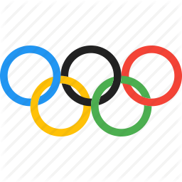

# DS_ProgrammingProject
Project for the programming course (Master's Degree in Data Science)


# GIADA PALMA - VR471280


## DATASET URL <br>
- OLYMPICS DATA https://www.kaggle.com/heesoo37/120-years-of-olympic-history-athletes-and-results<br>
- GDP https://www.kaggle.com/chadalee/country-wise-gdp-data<br>
- WORLD POPULATION https://www.kaggle.com/centurion1986/countries-population<br>
<br>


## BASIC DATASET EXPLORATION
Using:
info(), head(), tail() isnull(), describe() and groupby() methods
<br>


## DATA WRANGLING 
I have:
- Replaced null values in the noc_regions_ds with meaningful information
- Created unique values for the NOC (National Olympic Committee) column corresponding each to a specific region value
- Joined the dataset of the athlete_events with the dataset of the population
- Joined the dataset obtained from the above join with the dataset of the gdp to have all information in one dataset called 'olympic_history_ds'
- Performed some filtering to remove some null values from gdp and population columns due to differences in the year span of the datasets
<br>


## DATA ANALYSIS 
    1. Age distribution, age distribution by year, elder athletes's practiced sports distribution
    2. Gender distribution per sport and female partecipation history
    3. Medal distribution and GDP correlation
<br>


## PREDICTION
Which sport is the most suitable for an athlete based on sex, height, weight and age?
<br>


## STREAMLIT LIBRARY TO PRESENT THE PROJECT
For reference: https://docs.streamlit.io/
<br>


## HOW TO RUN THE PROJECT
Clone the directory https://github.com/GiadaPa/DS_ProgrammingProject.git
<br>Inside the directory run a terminal with the python command
```python
streamlit run OlympicHistory.py
```
This will open a browser with the project running.
<br>


## IMPORTANT
Usually it takes 1 minute to load the content. Be patient and enjoy with the interactive parts! :) 
<br>
